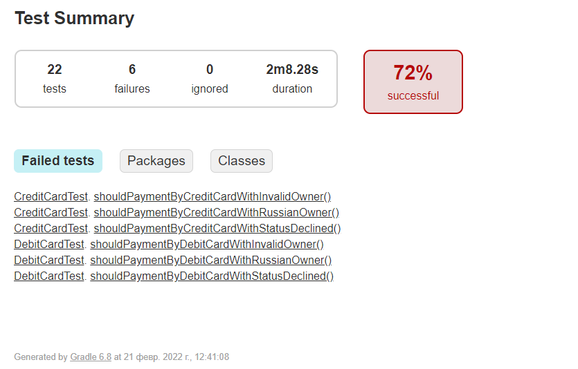
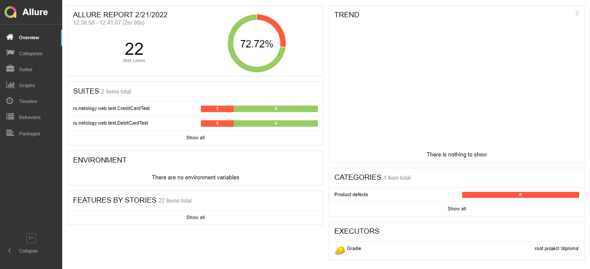
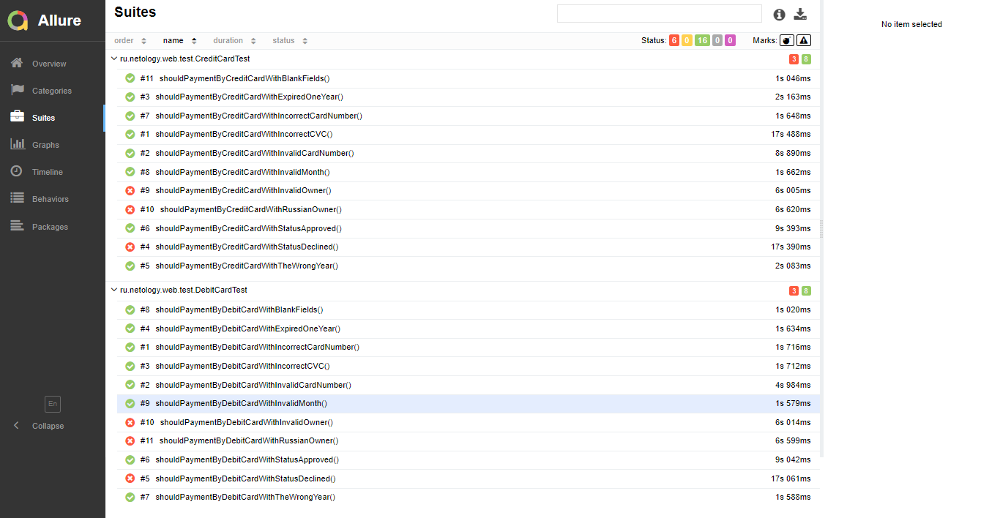

# Отчет по итогам автоматизированного тестирования

## Тестирование выполнялось по следующим сценариям:

### Позитивные:
1. Оплата дебетовой картой со статусом APPROVED и валидными данными
2. Оплата кредитной картой со статусом APPROVED и валидными данными

### Негативные:
3. Оплата дебетовой картой со статусом DECLINED и валидными данными
4. Оплата дебетовой картой, все поля пустые
5. Оплата дебетовой картой, невалидный номер карты (неверный формат)
6. Оплата дебетовой картой, невалидный номер карты (не из списка, верный формат)
7. Оплата дебетовой картой, невалидный месяц карты
8. Оплата дебетовой картой, невалидный год карты (истекший)
9. Оплата дебетовой картой, невалидный год карты (несколько лет вперед)
10. Оплата дебетовой картой, невалидное имя владельца (символы и цифры)
11. Оплата дебетовой картой, невалидное имя владельца (кириллица)
12. Оплата дебетовой картой, невалидный CVC/CVV

13. Оплата кредитной картой со статусом DECLINED и валидными данными
14. Оплата кредитной картой, все поля пустые
15. Оплата кредитной картой, невалидный номер карты (неверный формат)
16. Оплата кредитной картой, невалидный номер карты (не из списка, верный формат)
17. Оплата кредитной картой, невалидный месяц карты
18. Оплата кредитной картой, невалидный год карты (истекший)
19. Оплата кредитной картой, невалидный год карты (несколько лет вперед)
20. Оплата кредитной картой, невалидное имя владельца (символы и цифры)
21. Оплата кредитной картой, невалидное имя владельца (кириллица)
22. Оплата кредитной картой, невалидный CVC/CVV

## Использовались следующие инструменты:

**Система контроля версий:**

**Git.** Небольшой и быстрый. Обеспечивает все необходимые функции в т.ч. резервное копирование, ветвление (управление которым реализовано довольно просто и эффективно).

**Сервис онлайн-хостинга:**

**GitHub.** Удобный интерфейс, интегрирован с Git.

**Язык:**

**Java SE 11 (Java JDK 11).** Он имеет необоходимый и достаточный набор инструментов для автоматизации, имеет
удобную экосистему.

**Среда разработки:**

**IntelliJ IDEA.** Удобная среда разработки для Java с поддержкой последних технологий и фреймворков.

**Тестовый Фреймворк:**

**JUnit 5.** Удобен, содержит все необходимые для тестирования инструменты.

**Библиотеки, плагины:**

**Selenide.** Библиотека для написания лаконичных и стабильных тестов.

**Lombok.** Позволяет оптимизировать код автотестов, уменьшая усилия на разработку.

**Rest Assured.** Позволяет автоматизировать тестирование get и post запросов, и автоматизировать тестирование REST-API.

**JavaFaker.** Позволяет быстро и просто генерировать данные для тестов.

**Репортинг и CI:**

**Gradle.** Система автоматической сборки и проверки кода, позволяющая автоматически и без участия людей проверять код.
Легка в настройке, позволяет экономить время и пр.ресурсы на проекте.

**Allure.** Дает достаточно информации о похождении тестов и ошибок. Визуально нагляден, позволяет быстро анализировать
результат и исправлять ошибки в тестах.

**Контейнеризация:**

**Docker** — инструмент, позволяющий запускать мультиконтейнерные приложения, чтобы не устанавливать необходимые
для работы приложения Node.js и СУБД).
## **Количество тест-кейсов**

* Всего: 22 тест-кейсов
* Успешных: 16 (72,72%)
* Неуспешных: 6 (27,28%)

### **Отчет Gradle:**

### **Отчет Allure:**

### **Общие рекомендации**

#### **Обнаруженные проблемы**

[Оплата картой со статусом DECLINED одобряется банком](https://github.com/EvgeniaRepina/QADiploma/issues/2#issue-1145837968)

[Одобряется операция с невалидными символами в поле "Владелец"](https://github.com/EvgeniaRepina/QADiploma/issues/3#issue-1145899939)

[При отклонении операции покупки видны два уведомления: об успешности и об ошибке](https://github.com/EvgeniaRepina/QADiploma/issues/4#issue-1145961233)

Согласно этому списку, необходимо обратить внимание на модули работы с БД (проверку статуса карты), валидацию поля 
"Владелец" а также проверить атрибуты элементов в коде станицы. 
